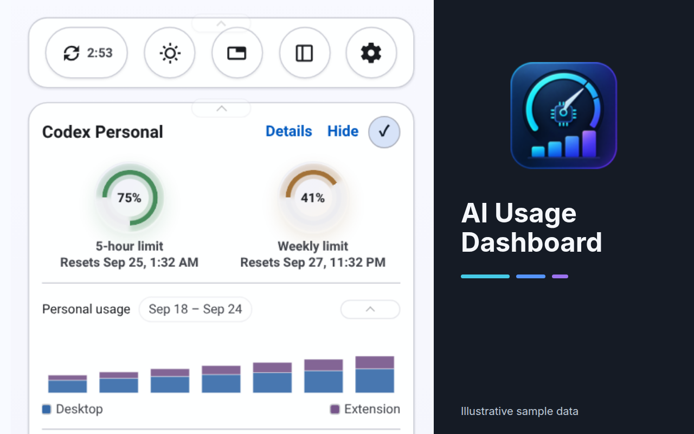
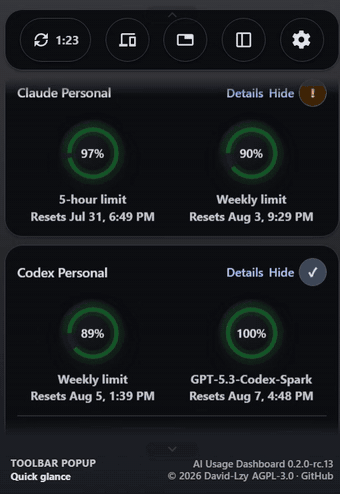
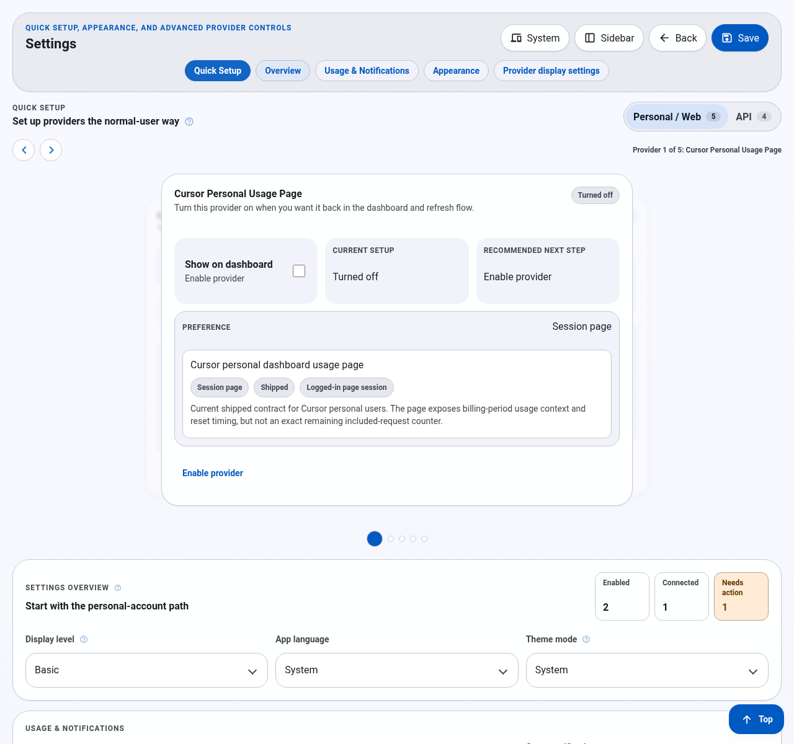

# AI Usage Dashboard

[](https://chromewebstore.google.com/detail/ai-usage-dashboard/mjfhaifoapcpbkffacidgjijcpiegjea)
[](https://github.com/David-Lzy/AI_Usage_Dashboard/releases)
[](./LICENSE)

**See AI coding quotas before they interrupt your work.**

AI Usage Dashboard brings source-visible quotas, credits, reset times, spending,
usage history, and sync health into one Chrome extension. Check a compact toolbar
popup, work from the side panel, or open the full dashboard without sending
provider data to a project-owned server.

**[Install from the Chrome Web Store](https://chromewebstore.google.com/detail/ai-usage-dashboard/mjfhaifoapcpbkffacidgjijcpiegjea)**
· [Download a GitHub build](https://github.com/David-Lzy/AI_Usage_Dashboard/releases)
· [Read the user documentation](./Doc/README.md)

The 0.2.1 GitHub release is available now. The Store may still serve RC14
until its separate update review completes.



_Current extension UI with illustrative QA values. No real accounts or credentials are included._

## Built For Daily Checks

- **Quotas and resets:** compare source-visible usage windows and see when they
  reset without reopening each provider dashboard.
- **Spend and API usage:** keep credits, actual spend, request counts, tokens,
  and returned limits close to the coding workflow.
- **History with context:** scan normalized daily trends where the source exposes
  them, while keeping raw page and request bodies out of extension storage.
- **Actionable sync health:** distinguish fresh data, retained last-successful
  data, missing access, partial contracts, and unsupported values.
- **Optional follow-through:** set quota/reset alerts, inspect a sanitized
  diagnostic report, and export supported aggregate usage as CSV.
- **A surface for the moment:** use a collapsible list, single-card switcher,
  auto-gliding popup, side panel, or full-page dashboard.

## See It In Action

<p align="center">
  
</p>

The short loop shows the real toolbar popup moving from personal quota windows
to Codex history and a Sub2API usage summary. The full-page dashboard and side
panel use the same normalized provider state.

## Get Started

1. Install the extension from the Chrome Web Store.
2. Open the toolbar popup and choose **Settings**.
3. Use **Quick Setup** to enable only the providers you use.
4. Grant optional host access or add an API credential only when that source
   requires it.
5. Return to the popup, side panel, or full-page dashboard for daily checks.

Chrome Web Store installation is recommended for normal use. The GitHub
release also contains a Chrome zip for developer-mode loading and an unsigned
Firefox local-beta package.

## Designed For Real Browser Work

- Exact, partial, window-scoped, policy-only, stale, and unavailable values are
  presented differently. The extension does not invent a balance that the
  source does not expose.
- Responsive Material-style layouts, light/dark/system/time themes, RTL support,
  and 14 interface locales are checked by an automated visual matrix.
- Provider order, visible modules, popup browsing, progress appearance, toolbar
  badges, reset-time formatting, motion, colors, and gradients remain under the
  user's control.

## Supported Sources

| Provider | Available source path | What the dashboard can show |
| --- | --- | --- |
| Codex | Enterprise analytics, signed-in Codex usage page, or opt-in same-machine CLI Companion | Source-visible usage windows, reset times, credits, and normalized history. Conditional API-equivalent estimates are not subscription charges. No plan-wide absolute balance is invented. |
| Claude | Signed-in Claude Personal usage page or Claude Code Analytics Admin API | Personal Pro usage windows and credit state, or separate organization analytics. |
| Cursor | Team Admin API or signed-in Usage/Spending pages | Team/API data or normalized personal billing pools, On-Demand charges, and aggregate history. |
| Sub2API | User-configured deployment and API key | Key-scoped balance, spend, requests, tokens, trends, models, and returned limits through the bounded `GET /v1/usage` contract. |
| Gemini Code Assist | Documented quota policy | Policy-only information in this release. |
| JetBrains AI | Retained implementation path | Deferred from the active release promise until organization-visible usage evidence is reverified. |

The extension is not an official product from OpenAI, Anthropic, Cursor,
Google, JetBrains, or any other provider.

## Privacy First

AI Usage Dashboard is deliberately conservative:

- You are never asked to paste cookies or raw browser authorization headers.
- Optional host permissions are requested only for the provider origins or
  custom endpoints you choose to connect.
- Optional API credentials stay in account-isolated extension-local storage
  and are sent only to the configured origin.
- Codex personal sync keeps its short-lived ChatGPT token in
  `chrome.storage.session`; it is not added to AppState, Chrome Sync, backups,
  logs, or fixtures.
- History capture stores only bounded normalized aggregates. Raw responses,
  page body text, cookies, request headers, and direct account identifiers are
  not retained.
- Custom HTTP/HTTPS JSON sources omit browser credentials, validate a public
  schema, and never render or save the raw response body.
- The extension does not load or execute remote code.

Read the full [privacy policy](./PRIVACY.md) and [security policy](./SECURITY.md)
before connecting a provider or custom endpoint.

## Personalize The Dashboard

- Quick Setup is the first Settings section and navigation item, so provider
  selection is available before appearance and advanced controls.
- Settings separates **Usage & Notifications** (sync interval, in-app warning,
  optional system notifications, and configuration backup) from **Appearance**
  (color, motion, popup browsing, and advanced UI controls). The in-app warning
  and notification trigger percentages are independent. Notifications use a
  compact Off / On / Paused selector; account and threshold options appear when
  enabled.
- Choose traditional remaining-percentage bands or an editable one-dimensional
  gradient shared by popup, side panel, full-page, detail, and preview surfaces.
- Generate a gradient locally from a PNG, JPEG, or WebP image. Only the derived
  color stops are saved; the image and its metadata are not uploaded or stored.
- Set motion to On, Reduced, or Follow system. On remains the default and can
  keep app motion enabled when the operating system requests reduced motion.
- Format quota resets as localized date and time, weekday and time, or both.
- Enable the default-off quota pace estimate in Provider detail for fresh,
  fixed-duration windows. It is a local presentation estimate, not source data.



_Settings Quick Setup preview rendered from synthetic QA snapshots. No real
accounts, credentials, or usage evidence are included._

## Extend It

### Custom JSON Sources

Add client-provided HTTP or HTTPS quota endpoints that implement the public
`ai-usage-dashboard.custom-source.v1` schema. Custom data is always labeled as
custom and never treated as an official provider result. See the
[JSON contract and examples](./Doc/Product/Custom_JSON_Sources.md).

### API Gateways And Local Tools

- [Sub2API usage contract](./Doc/Product/Sub2API_User_Usage_Contract.md)
- [Experimental Local Companion Bridge](./Doc/Product/Local_Companion_Bridge.md)
- [Optional CodexBar dashboard adoption boundary](./Doc/Product/CodexBar_Upstream_Adoption.md)

Local companions are never installed, started, discovered, or updated by the
extension. Generic accepted local rows remain separate custom sources. The
0.2.1 source includes an opt-in, same-machine Codex CLI bridge for the built-in
Codex Personal quota. After manual pairing, local-only mode can replace
browser-page quota refreshes with local quota reads. API-equivalent estimates
appear only after sufficient complete, priced observations; they are not
subscription charges or balances. See the
[bridge contract](./Doc/Product/Local_Companion_Bridge.md) for setup, limits,
and privacy boundaries. Store availability may lag the source release during
review.

## Manual Installation

```sh
npm install
npm run build
```

Open `chrome://extensions`, enable Developer mode, choose **Load unpacked**,
and select `dist/chrome/`.

## Documentation

- [Documentation entry point](./Doc/README.md)
- [Provider setup and display contract](./Doc/Product/Provider_Setup_Display_Product_Contract.md)
- [Provider authoring guide](./Doc/Product/Provider_Authoring_Guide.md)
- [Chrome Web Store listing copy](./Doc/Store/README.md)
- [Contributing guide](./CONTRIBUTING.md)

## Development

Requirements: Node.js `>=22.12.0` and npm.

```sh
npm run dev
npm run test
npm run typecheck
npm run build
npm run release:check
```

The default build writes the Chrome extension to `dist/chrome/`. Firefox local
beta output is written to `dist/firefox/`; use `npm run firefox:build`,
`npm run firefox:lint:baseline`, and `npm run firefox:package` for that path.

Pull requests targeting `main` run read-only quality checks and build temporary
Chrome and Firefox artifacts, without publishing. Pushes to `main` also run
these checks. Version tags create a GitHub Release with separately named
browser packages and SHA-256 checksums. Store API credentials, when configured,
allow a tag workflow to upload the Chrome package and submit it for review.
See [GitHub release and notes rules](./Doc/Store/GitHub_Release_Push_And_Notes.md).

In short, each version tag produces a GitHub Release with Chrome and Firefox package zips plus
`SHA256SUMS.txt`.

## Current Release State

- The [Chrome Web Store listing](https://chromewebstore.google.com/detail/ai-usage-dashboard/mjfhaifoapcpbkffacidgjijcpiegjea)
  displays `0.2.0-rc.14`, verified by a direct public-page fetch on
  2026-09-23 UTC. The authenticated Store API reports manifest `0.2.0.14`
  as `PUBLISHED` at 100%.
- Source package version: `0.2.1`; Chrome manifest version: `0.2.1.0`.
- GitHub Release [`v0.2.1`](https://github.com/David-Lzy/AI_Usage_Dashboard/releases/tag/v0.2.1)
  is stable and provides verified Chrome and unsigned Firefox local-beta
  packages plus `SHA256SUMS.txt`. Its tag workflow passed on 2026-09-24 UTC.
- RC14 remains the verified Store baseline. The 0.2.1 release adds the new
  Settings organization, diagnostics, notifications, comparison, export, and
  optional Codex local bridge; these are not Store features until the 0.2.1
  package is separately published there.
- The authenticated Store API accepted the `0.2.1.0` package upload on
  2026-09-24 UTC. Listing text and image updates still require the Developer
  Dashboard, so the revision has not been submitted for review.
- Publication status is tracked in the
  [Chrome Web Store milestone](./Doc/Store/Chrome_Web_Store_Publication_Milestone.md).

Generated packages, hashes, upload receipts, and personal submission evidence
remain outside the public repository.

## Contributors

- [donaldpeng17](https://github.com/donaldpeng17) - fixed a Claude Code
  personal-user dashboard issue in
  [#1](https://github.com/David-Lzy/AI_Usage_Dashboard/pull/1).

Contributions are welcome. Please keep provider claims conservative and preserve
the project's privacy boundaries.

## License

AI Usage Dashboard is licensed under the
[GNU Affero General Public License v3.0 only](./LICENSE).
